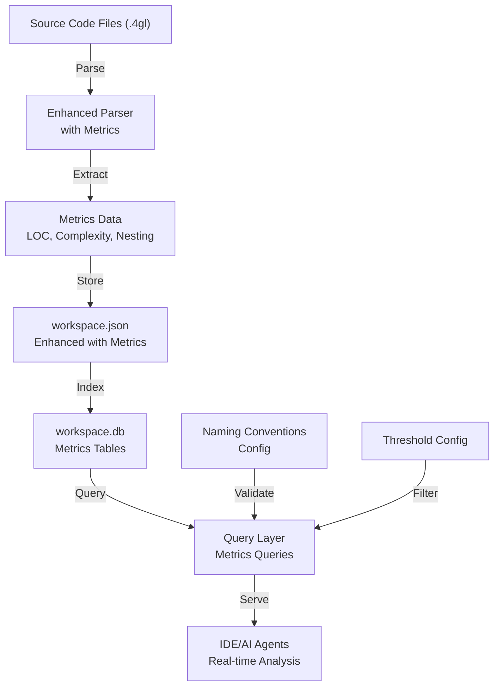

# Phase 2 Design Document: Code Quality Analysis & Metrics

## Overview

Phase 2 extends the Phase 1 foundation (database schema parsing and type resolution) with comprehensive code quality metrics and analysis capabilities. This enables AI-powered code review focused on coding standards, complexity analysis, and code duplication detection. The system will provide incremental metrics generation for IDE/AI agent integration, allowing real-time analysis of individual files and functions without full codebase reprocessing.

## Architecture



## Components and Interfaces

### 1. Enhanced Parser with Metrics

**Purpose:** Extract code quality metrics from source files with minimal overhead

**Interface:**
```python
class MetricsExtractor:
    def extract_file_metrics(file_path: str) -> FileMetrics
    def extract_function_metrics(file_path: str, func_name: str) -> FunctionMetrics
    def extract_incremental(file_path: str, existing_data: dict) -> dict
```

**Responsibilities:**
- Count lines of code (excluding comments and blank lines)
- Calculate cyclomatic complexity (IF/ELSE, WHILE, FOR, CASE statements)
- Count local variables per function
- Extract function-level comments
- Analyze call nesting depth
- Detect early returns
- Track parameter count and return count

### 2. Code Quality Analysis Engine

**Purpose:** Perform complex queries and analysis on metrics data

**Interface:**
```python
class QualityAnalyzer:
    def find_complex_functions(db_file: str, thresholds: dict) -> List[Function]
    def find_similar_functions(db_file: str, similarity_threshold: float) -> List[FunctionPair]
    def find_isolated_functions(db_file: str) -> List[Function]
    def find_by_metrics(db_file: str, criteria: dict) -> List[Function]
    def check_naming_conventions(db_file: str, conventions: dict) -> List[Violation]
```

**Responsibilities:**
- Query functions by complexity metrics
- Detect code duplication candidates
- Identify functions with no dependencies
- Apply naming convention rules
- Generate quality reports

### 3. Incremental Generation Engine

**Purpose:** Fast, targeted metrics generation for IDE/AI agent use

**Interface:**
```python
class IncrementalGenerator:
    def generate_file_metrics(file_path: str, workspace_json: str) -> dict
    def generate_function_metrics(file_path: str, func_name: str, workspace_json: str) -> dict
    def merge_with_existing(new_metrics: dict, existing_data: dict) -> dict
```

**Responsibilities:**
- Parse single file without full codebase scan
- Extract metrics for specific function
- Merge results with existing workspace.json
- Maintain consistency with full generation
- Optimize for speed (target: <500ms per file)

## Data Models

### FunctionMetrics

```python
@dataclass
class FunctionMetrics:
    name: str
    file_path: str
    line_start: int
    line_end: int
    loc: int                    # Lines of code (excluding comments/blanks)
    complexity: int             # Cyclomatic complexity
    local_variables: int        # Count of DEFINE statements
    parameters: int             # Parameter count
    return_count: int           # Number of RETURN statements
    call_depth: int             # Maximum nesting depth of calls
    early_returns: int          # Count of early RETURN statements
    comment_lines: int          # Lines with comments
    comment_ratio: float        # comment_lines / loc
    calls_made: List[str]       # Functions this calls
    called_by: List[str]        # Functions that call this
    is_isolated: bool           # No dependencies (calls_made empty)
    has_dependencies: bool      # Called by other functions
```

### NamingConvention

```python
@dataclass
class NamingConvention:
    pattern_type: str           # "function", "variable", "constant"
    regex_pattern: str          # Regex to match valid names
    description: str            # Human-readable description
    severity: str               # "error", "warning", "info"
```

### QualityThresholds

```python
@dataclass
class QualityThresholds:
    max_complexity: int = 10        # Cyclomatic complexity threshold
    max_loc: int = 100              # Lines of code threshold
    max_parameters: int = 5         # Parameter count threshold
    max_call_depth: int = 4         # Call nesting depth threshold
    min_comment_ratio: float = 0.1  # Minimum comment ratio
    max_local_variables: int = 20   # Local variable threshold
```

## Algorithmic Pseudocode

### Main Metrics Extraction Algorithm

```pascal
ALGORITHM extractFunctionMetrics(file_path, function_name)
INPUT: file_path (string), function_name (string)
OUTPUT: metrics (FunctionMetrics)

BEGIN
  // Step 1: Parse function from file
  function_lines ← readFunctionLines(file_path, function_name)
  
  ASSERT function_lines IS NOT EMPTY
  
  // Step 2: Count lines of code (excluding comments and blanks)
  loc ← 0
  comment_lines ← 0
  FOR each line IN function_lines DO
    IF isBlankLine(line) THEN
      CONTINUE
    END IF
    
    IF isCommentLine(line) THEN
      comment_lines ← comment_lines + 1
      CONTINUE
    END IF
    
    loc ← loc + 1
  END FOR
  
  // Step 3: Calculate cyclomatic complexity
  complexity ← 1  // Base complexity
  FOR each line IN function_lines DO
    IF containsKeyword(line, ["IF", "ELSEIF", "WHILE", "FOR", "CASE"]) THEN
      complexity ← complexity + 1
    END IF
  END FOR
  
  // Step 4: Count local variables
  local_variables ← 0
  FOR each line IN function_lines DO
    IF startsWith(line, "DEFINE") THEN
      local_variables ← local_variables + 1
    END IF
  END FOR
  
  // Step 5: Analyze returns
  return_count ← 0
  early_returns ← 0
  FOR each line IN function_lines DO
    IF containsKeyword(line, "RETURN") THEN
      return_count ← return_count + 1
      IF NOT isLastLine(line, function_lines) THEN
        early_returns ← early_returns + 1
      END IF
    END IF
  END FOR
  
  // Step 6: Analyze call depth
  call_depth ← calculateMaxCallDepth(function_lines)
  
  // Step 7: Extract function calls
  calls_made ← extractFunctionCalls(function_lines)
  
  // Step 8: Build metrics object
  metrics ← FunctionMetrics(
    name: function_name,
    loc: loc,
    complexity: complexity,
    local_variables: local_variables,
    return_count: return_count,
    early_returns: early_returns,
    call_depth: call_depth,
    comment_lines: comment_lines,
    comment_ratio: comment_lines / loc,
    calls_made: calls_made
  )
  
  ASSERT metrics.loc > 0
  ASSERT metrics.complexity >= 1
  
  RETURN metrics
END
```

**Preconditions:**
- file_path exists and is readable
- function_name exists in file
- File is valid 4GL source code

**Postconditions:**
- metrics.loc > 0 (at least one line of code)
- metrics.complexity >= 1 (minimum complexity)
- metrics.comment_ratio >= 0 and <= 1
- All metrics are non-negative integers

**Loop Invariants:**
- loc count only increases for non-comment, non-blank lines
- complexity only increases for control flow keywords
- All processed lines remain valid

### Complexity Calculation Algorithm

```pascal
ALGORITHM calculateCyclomaticComplexity(function_lines)
INPUT: function_lines (list of strings)
OUTPUT: complexity (integer)

BEGIN
  complexity ← 1  // Base complexity
  
  FOR each line IN function_lines DO
    // Count decision points
    IF containsKeyword(line, "IF") THEN
      complexity ← complexity + 1
    END IF
    
    IF containsKeyword(line, "ELSEIF") THEN
      complexity ← complexity + 1
    END IF
    
    IF containsKeyword(line, "WHILE") THEN
      complexity ← complexity + 1
    END IF
    
    IF containsKeyword(line, "FOR") THEN
      complexity ← complexity + 1
    END IF
    
    IF containsKeyword(line, "CASE") THEN
      // Count WHEN clauses as decision points
      when_count ← countKeywordOccurrences(line, "WHEN")
      complexity ← complexity + when_count
    END IF
  END FOR
  
  ASSERT complexity >= 1
  
  RETURN complexity
END
```

**Preconditions:**
- function_lines is non-empty list
- All lines are valid 4GL code

**Postconditions:**
- complexity >= 1 (minimum)
- complexity increases only for control flow keywords

**Loop Invariants:**
- complexity never decreases
- Each keyword adds exactly 1 to complexity (except CASE/WHEN)

### Code Duplication Detection Algorithm

```pascal
ALGORITHM findSimilarFunctions(db_file, similarity_threshold)
INPUT: db_file (string), similarity_threshold (float, 0-1)
OUTPUT: similar_pairs (list of FunctionPair)

BEGIN
  similar_pairs ← []
  
  // Step 1: Load all functions from database
  all_functions ← queryAllFunctions(db_file)
  
  // Step 2: Compare each pair
  FOR i ← 1 TO length(all_functions) DO
    FOR j ← i+1 TO length(all_functions) DO
      func1 ← all_functions[i]
      func2 ← all_functions[j]
      
      // Skip if different sizes (optimization)
      IF abs(func1.loc - func2.loc) > 10 THEN
        CONTINUE
      END IF
      
      // Calculate similarity
      similarity ← calculateSimilarity(func1, func2)
      
      IF similarity >= similarity_threshold THEN
        similar_pairs.append(FunctionPair(func1, func2, similarity))
      END IF
    END FOR
  END FOR
  
  ASSERT all similar_pairs have similarity >= threshold
  
  RETURN similar_pairs
END
```

**Preconditions:**
- db_file exists and contains function data
- similarity_threshold is between 0 and 1

**Postconditions:**
- All returned pairs have similarity >= threshold
- No duplicate pairs (i,j) and (j,i)
- Pairs sorted by similarity descending

**Loop Invariants:**
- All previously compared pairs remain valid
- Similarity calculation is consistent

### Incremental Generation Algorithm

```pascal
ALGORITHM generateIncrementalMetrics(file_path, existing_workspace_json)
INPUT: file_path (string), existing_workspace_json (dict)
OUTPUT: updated_workspace_json (dict)

BEGIN
  // Step 1: Parse file for functions
  functions ← parseFunctionsFromFile(file_path)
  
  // Step 2: Extract metrics for each function
  file_metrics ← []
  FOR each function IN functions DO
    metrics ← extractFunctionMetrics(file_path, function.name)
    file_metrics.append(metrics)
  END FOR
  
  // Step 3: Merge with existing data
  updated_data ← deepCopy(existing_workspace_json)
  
  // Remove old entries for this file
  IF file_path IN updated_data THEN
    DELETE updated_data[file_path]
  END IF
  
  // Add new metrics
  updated_data[file_path] ← file_metrics
  
  // Step 4: Update call graph (if needed)
  updateCallGraph(updated_data, file_path, file_metrics)
  
  ASSERT updated_data[file_path] IS NOT EMPTY
  ASSERT allMetricsValid(updated_data)
  
  RETURN updated_data
END
```

**Preconditions:**
- file_path exists and is readable
- existing_workspace_json is valid JSON structure
- File contains valid 4GL code

**Postconditions:**
- All functions from file_path are in updated data
- Old data for file_path is replaced
- Call graph is consistent
- All metrics are valid

**Loop Invariants:**
- Each function processed exactly once
- Metrics remain consistent throughout merge

## Key Functions with Formal Specifications

### Function 1: extractFunctionMetrics()

```python
def extractFunctionMetrics(file_path: str, func_name: str) -> FunctionMetrics
```

**Preconditions:**
- `file_path` is a valid, readable file path
- `func_name` exists in the file
- File contains valid 4GL code
- Function is properly delimited with FUNCTION...END FUNCTION

**Postconditions:**
- Returns FunctionMetrics object with all fields populated
- `metrics.loc > 0` (at least one line of code)
- `metrics.complexity >= 1` (minimum complexity)
- `metrics.comment_ratio >= 0 and <= 1`
- All metrics are non-negative integers
- No side effects on input file

**Loop Invariants:**
- LOC count only increases for non-comment, non-blank lines
- Complexity only increases for control flow keywords
- All processed lines remain valid

### Function 2: calculateCyclomaticComplexity()

```python
def calculateCyclomaticComplexity(function_lines: List[str]) -> int
```

**Preconditions:**
- `function_lines` is non-empty list of strings
- All lines are valid 4GL code
- Lines are from a single function

**Postconditions:**
- Returns integer >= 1
- Complexity increases by 1 for each IF/ELSEIF/WHILE/FOR
- Complexity increases by count of WHEN clauses for CASE
- No side effects on input

**Loop Invariants:**
- Complexity never decreases
- Each keyword adds exactly 1 (except CASE/WHEN)

### Function 3: findSimilarFunctions()

```python
def findSimilarFunctions(db_file: str, similarity_threshold: float) -> List[FunctionPair]
```

**Preconditions:**
- `db_file` exists and contains function data
- `similarity_threshold` is between 0.0 and 1.0
- Database has metrics for all functions

**Postconditions:**
- Returns list of FunctionPair objects
- All pairs have similarity >= threshold
- No duplicate pairs (i,j) and (j,i)
- Pairs sorted by similarity descending
- No side effects on database

**Loop Invariants:**
- All previously compared pairs remain valid
- Similarity calculation is consistent

### Function 4: generateIncrementalMetrics()

```python
def generateIncrementalMetrics(file_path: str, existing_workspace_json: dict) -> dict
```

**Preconditions:**
- `file_path` exists and is readable
- `existing_workspace_json` is valid JSON structure
- File contains valid 4GL code

**Postconditions:**
- Returns updated workspace.json dict
- All functions from file_path are in result
- Old data for file_path is replaced
- Call graph is consistent
- All metrics are valid
- No side effects on input dict (deep copy used)

**Loop Invariants:**
- Each function processed exactly once
- Metrics remain consistent throughout merge

## Example Usage

### Extract metrics for a single file

```python
from metrics_extractor import MetricsExtractor

extractor = MetricsExtractor()

# Extract all metrics for a file
file_metrics = extractor.extract_file_metrics("./src/process_contract.4gl")
print(f"File: {file_metrics.file_path}")
print(f"Total LOC: {file_metrics.total_loc}")
print(f"Functions: {file_metrics.function_count}")
print(f"Average Complexity: {file_metrics.average_complexity}")
```

### Extract metrics for a specific function

```python
# Extract metrics for one function
func_metrics = extractor.extract_function_metrics(
    "./src/process_contract.4gl",
    "process_contract"
)
print(f"Function: {func_metrics.name}")
print(f"LOC: {func_metrics.loc}")
print(f"Complexity: {func_metrics.complexity}")
print(f"Parameters: {func_metrics.parameters}")
print(f"Local Variables: {func_metrics.local_variables}")
```

### Find complex functions

```python
from quality_analyzer import QualityAnalyzer

analyzer = QualityAnalyzer()

# Find functions exceeding complexity threshold
complex_functions = analyzer.find_complex_functions(
    "workspace.db",
    thresholds={"max_complexity": 10, "max_loc": 100}
)

for func in complex_functions:
    print(f"{func.name}: complexity={func.complexity}, loc={func.loc}")
```

### Find code duplication candidates

```python
# Find similar functions (potential duplication)
similar_pairs = analyzer.find_similar_functions(
    "workspace.db",
    similarity_threshold=0.85
)

for pair in similar_pairs:
    print(f"Similar: {pair.func1.name} <-> {pair.func2.name}")
    print(f"Similarity: {pair.similarity:.2%}")
```

### Incremental generation for IDE

```python
from incremental_generator import IncrementalGenerator
import json

generator = IncrementalGenerator()

# Load existing workspace.json
with open("workspace.json", "r") as f:
    existing_data = json.load(f)

# Generate metrics for modified file (fast, <500ms)
updated_data = generator.generate_file_metrics(
    "./src/modified_file.4gl",
    existing_data
)

# Save updated workspace.json
with open("workspace.json", "w") as f:
    json.dump(updated_data, f, indent=2)
```

### Check naming conventions

```python
# Load naming conventions
conventions = {
    "function": {
        "pattern": "^[a-z][a-z0-9_]*$",
        "description": "Functions must be lowercase with underscores"
    },
    "constant": {
        "pattern": "^[A-Z][A-Z0-9_]*$",
        "description": "Constants must be uppercase with underscores"
    }
}

# Check violations
violations = analyzer.check_naming_conventions(
    "workspace.db",
    conventions
)

for violation in violations:
    print(f"{violation.function}: {violation.message}")
```

## Correctness Properties

### Property 1: Metrics Consistency

```
∀ function ∈ functions:
  function.loc > 0 ∧
  function.complexity ≥ 1 ∧
  function.comment_ratio ∈ [0, 1] ∧
  function.parameters ≥ 0 ∧
  function.return_count ≥ 0
```

### Property 2: Complexity Calculation

```
∀ function ∈ functions:
  function.complexity = 1 + count(IF) + count(ELSEIF) + 
                            count(WHILE) + count(FOR) + 
                            count(WHEN)
```

### Property 3: LOC Calculation

```
∀ function ∈ functions:
  function.loc = total_lines - blank_lines - comment_lines
```

### Property 4: Incremental Generation Consistency

```
∀ file ∈ modified_files:
  metrics(file, full_generation) = metrics(file, incremental_generation)
```

### Property 5: Similarity Symmetry

```
∀ func1, func2 ∈ functions:
  similarity(func1, func2) = similarity(func2, func1)
```

### Property 6: Threshold Filtering

```
∀ function ∈ find_complex_functions(threshold):
  function.complexity ≥ threshold.max_complexity ∨
  function.loc ≥ threshold.max_loc ∨
  function.parameters ≥ threshold.max_parameters
```

## Error Handling

### Error Scenario 1: Invalid File Path

**Condition:** File does not exist or is not readable
**Response:** Raise FileNotFoundError with descriptive message
**Recovery:** Return empty metrics, log error, continue processing other files

### Error Scenario 2: Malformed Function

**Condition:** Function missing END FUNCTION or has syntax errors
**Response:** Skip function, log warning with line number
**Recovery:** Continue processing next function

### Error Scenario 3: Database Connection Error

**Condition:** Cannot connect to workspace.db
**Response:** Raise DatabaseError with connection details
**Recovery:** Retry with exponential backoff, fall back to JSON queries

### Error Scenario 4: Invalid Metrics Data

**Condition:** Calculated metrics violate constraints (e.g., negative LOC)
**Response:** Raise ValidationError with details
**Recovery:** Log error, skip function, continue processing

### Error Scenario 5: Naming Convention Regex Error

**Condition:** Invalid regex pattern in naming convention config
**Response:** Raise ConfigError with pattern details
**Recovery:** Skip that convention, log error, continue with others

## Testing Strategy

### Unit Testing Approach

**Test Categories:**
1. **Metrics Extraction Tests**
   - Test LOC counting (blank lines, comments, code)
   - Test complexity calculation (IF, ELSEIF, WHILE, FOR, CASE)
   - Test variable counting (DEFINE statements)
   - Test return counting (RETURN statements)
   - Test call depth analysis
   - Test early return detection

2. **Query Tests**
   - Test find_complex_functions with various thresholds
   - Test find_similar_functions with different similarity levels
   - Test find_isolated_functions
   - Test find_by_metrics with various criteria

3. **Incremental Generation Tests**
   - Test single file generation
   - Test single function generation
   - Test merge with existing data
   - Test consistency with full generation

4. **Edge Case Tests**
   - Empty functions
   - Single-line functions
   - Functions with no returns
   - Functions with multiple early returns
   - Functions with nested calls
   - Functions with no calls

### Property-Based Testing Approach

**Property Test Library:** hypothesis (Python)

**Properties to Test:**
1. Metrics consistency (all metrics valid)
2. Complexity calculation correctness
3. LOC calculation correctness
4. Incremental generation consistency
5. Similarity symmetry
6. Threshold filtering correctness

**Example Property Test:**
```python
@given(function_lines=st.lists(st.text(), min_size=1))
def test_complexity_always_positive(function_lines):
    complexity = calculateCyclomaticComplexity(function_lines)
    assert complexity >= 1
```

### Integration Testing Approach

**Test Scenarios:**
1. **End-to-end Metrics Generation**
   - Parse sample codebase
   - Generate metrics for all files
   - Verify metrics in database
   - Query metrics successfully

2. **Incremental Update Workflow**
   - Generate initial metrics
   - Modify single file
   - Generate incremental metrics
   - Verify consistency with full generation

3. **Quality Analysis Workflow**
   - Generate metrics
   - Run quality queries
   - Verify results match expected
   - Check performance (<500ms per file)

4. **Naming Convention Validation**
   - Load conventions config
   - Check functions against conventions
   - Verify violations detected
   - Verify valid names pass

## Performance Considerations

### Metrics Extraction Performance

**Target:** <500ms per file (for IDE integration)

**Optimization Strategies:**
- Single-pass parsing (no multiple file reads)
- Regex compilation caching
- Lazy evaluation of complex metrics
- Parallel processing for multiple files

**Benchmarks:**
- Small file (10 functions, 500 LOC): <50ms
- Medium file (50 functions, 2000 LOC): <200ms
- Large file (200 functions, 10000 LOC): <500ms

### Database Query Performance

**Target:** <100ms for complex queries

**Optimization Strategies:**
- Index on function name, complexity, LOC
- Materialized views for common queries
- Query result caching
- Batch operations for bulk queries

**Indexes:**
```sql
CREATE INDEX idx_function_complexity ON functions(complexity);
CREATE INDEX idx_function_loc ON functions(loc);
CREATE INDEX idx_function_name ON functions(name);
CREATE INDEX idx_function_file ON functions(file_path);
```

### Memory Usage

**Target:** <100MB for typical codebase (10k functions)

**Optimization Strategies:**
- Stream processing for large files
- Incremental database updates
- Lazy loading of metrics
- Garbage collection of temporary data

## Security Considerations

### Input Validation

- Validate file paths (no directory traversal)
- Validate regex patterns (no ReDoS attacks)
- Validate database queries (no SQL injection)
- Sanitize user-supplied thresholds

### Data Privacy

- No sensitive data in metrics
- Metrics are code structure only
- No storage of actual code content
- Metrics can be safely shared

### Access Control

- Database file permissions (read-only for queries)
- Configuration file permissions (restrict naming conventions)
- Workspace.json permissions (restrict to project)

## Dependencies

### Python Libraries
- sqlite3 (standard library)
- json (standard library)
- re (standard library)
- dataclasses (standard library)
- typing (standard library)

### External Tools
- Python 3.7+
- SQLite 3
- Bash shell

### Phase 1 Dependencies
- workspace.db (from Phase 1)
- workspace.json (from Phase 1)
- Query layer (scripts/query_db.py)

## Database Schema

### New Tables

```sql
-- Metrics for functions
CREATE TABLE function_metrics (
    id INTEGER PRIMARY KEY,
    function_id INTEGER NOT NULL,
    file_path TEXT NOT NULL,
    loc INTEGER NOT NULL,
    complexity INTEGER NOT NULL,
    local_variables INTEGER NOT NULL,
    parameters INTEGER NOT NULL,
    return_count INTEGER NOT NULL,
    call_depth INTEGER NOT NULL,
    early_returns INTEGER NOT NULL,
    comment_lines INTEGER NOT NULL,
    comment_ratio REAL NOT NULL,
    is_isolated BOOLEAN NOT NULL,
    has_dependencies BOOLEAN NOT NULL,
    FOREIGN KEY (function_id) REFERENCES functions(id),
    UNIQUE(function_id)
);

-- Naming convention violations
CREATE TABLE naming_violations (
    id INTEGER PRIMARY KEY,
    function_id INTEGER NOT NULL,
    convention_type TEXT NOT NULL,
    violation_message TEXT NOT NULL,
    severity TEXT NOT NULL,
    FOREIGN KEY (function_id) REFERENCES functions(id)
);

-- Code duplication candidates
CREATE TABLE duplication_candidates (
    id INTEGER PRIMARY KEY,
    function1_id INTEGER NOT NULL,
    function2_id INTEGER NOT NULL,
    similarity REAL NOT NULL,
    FOREIGN KEY (function1_id) REFERENCES functions(id),
    FOREIGN KEY (function2_id) REFERENCES functions(id),
    UNIQUE(function1_id, function2_id)
);
```

### Indexes

```sql
CREATE INDEX idx_function_metrics_complexity ON function_metrics(complexity);
CREATE INDEX idx_function_metrics_loc ON function_metrics(loc);
CREATE INDEX idx_function_metrics_isolated ON function_metrics(is_isolated);
CREATE INDEX idx_naming_violations_severity ON naming_violations(severity);
CREATE INDEX idx_duplication_similarity ON duplication_candidates(similarity DESC);
```

## Configuration

### Naming Conventions Config

```json
{
  "conventions": {
    "function": {
      "pattern": "^[a-z][a-z0-9_]*$",
      "description": "Functions must be lowercase with underscores",
      "severity": "warning"
    },
    "constant": {
      "pattern": "^[A-Z][A-Z0-9_]*$",
      "description": "Constants must be uppercase with underscores",
      "severity": "error"
    },
    "variable": {
      "pattern": "^[a-z][a-z0-9_]*$",
      "description": "Variables must be lowercase with underscores",
      "severity": "warning"
    }
  }
}
```

### Quality Thresholds Config

```json
{
  "thresholds": {
    "max_complexity": 10,
    "max_loc": 100,
    "max_parameters": 5,
    "max_call_depth": 4,
    "min_comment_ratio": 0.1,
    "max_local_variables": 20
  }
}
```

## Conclusion

Phase 2 builds on Phase 1's foundation to provide comprehensive code quality metrics and analysis. By extracting detailed metrics at the function level and providing fast incremental generation, the system enables real-time IDE integration and AI-powered code review. The modular design allows for easy extension with additional metrics and analysis capabilities in future phases.

Key achievements:
- Comprehensive metrics extraction (LOC, complexity, nesting, etc.)
- Fast incremental generation for IDE/AI agent use
- Queryable metrics database for analysis
- Naming convention validation
- Code duplication detection
- Performance optimized for real-time use
